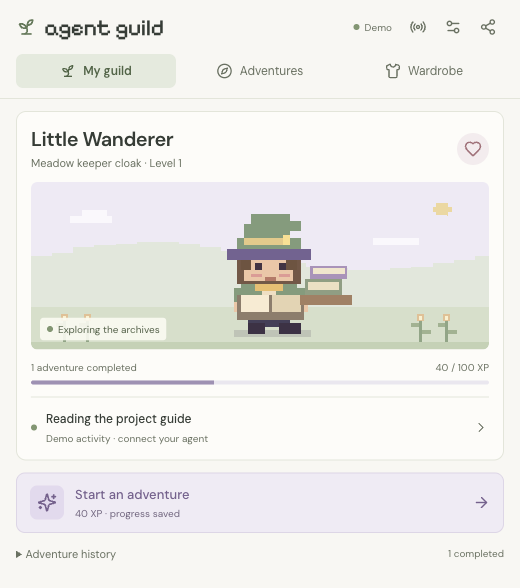

# Agent Guild

Your coding agent, brought to life on your desktop—with little adventures while you wait.

A macOS-first, open-source desktop companion. Pixel characters reflect live coding-agent activity along your screen edge. Short adventures, persistent cosmetics, and shareable guild cards give waiting a little personality.



## What you can do

- Keep a transparent pixel companion near your Dock while working in other apps.
- Follow an existing **OpenCode V2** session from its executing plugin or the shared service: reading, editing, commands, attention requests, and turn lifecycle.
- Receive experimental **Codex / Claude Code** lifecycle hooks through the local activity bridge.
- Inspect the source events behind its work state.
- Play three short memory-trail variants, leave midway, and resume your saved adventure.
- Earn adventure XP, unlock four cloaks, and meet a woodland fox.
- Export a PNG guild postcard with optional adventure activity and selected-session token totals.
- Try the clearly labeled synthetic demo immediately.

The desktop companion is a transparent overlay. The guild panel opens when you want to play, customize, or inspect. Game adventures are fictional; they do not claim to explain hidden agent reasoning or code correctness.

The panel is a compact **520 × 620** window: three tabs for your companion, adventures, and wardrobe, with activity/settings/share shortcuts in the header. Adventure history and signal explanations expand when needed.

## Run locally

Requires **Node.js 22+**, npm, and macOS. The initial native checks were run on Apple Silicon. Windows and Linux support are planned.

```sh
git clone https://github.com/azrialahmad/agent-guild.git
cd agent-guild
npm ci
npm run dev
```

The app starts in demo mode. To connect a real agent:

1. Start your usual OpenCode V2 interface.
2. In Agent Guild, open **Settings → Find local sessions**.
3. Choose a session and click **Follow this session**.
4. Return to your coding interface. The companion follows observed activity without issuing prompts or approving tools.

The direct connector uses the official `@opencode/client` and the shared V2 background service. A private-server UI can read the same saved sessions while owning a separate execution: prefer the **OpenCode plugin** source in that case. Native plugin checks passed on **OpenCode 2.0.19** and OpenChamber's **2.0.15** server. Codex/Claude hook payloads and transport are tested, but live CLI loading/execution is not yet verified. V1 and remote/cloud agents are not supported.

### Coding-agent adapters

See [`integrations/README.md`](integrations/README.md) for OpenCode plugin configuration, Claude Code local-plugin loading, and Codex plugin/hook setup. This checkout enables the OpenCode plugin for its own project through `opencode.json`. The adapters send lifecycle metadata from the executing harness to the existing desktop process; they add no separate always-running helper or model prompt. Source identity and last-signal time are shown in **Agent activity** and the overlay status tooltip. Stale signals become unknown, not idle.

### Desktop controls

- Click the character to open your guild.
- Hover to reveal pet, adventure, and drag controls.
- The heart pets your companion; the sparkle opens **Adventures** directly.
- Drag the grip to reposition within a display's usable work area.
- Use the lantern menu-bar icon to show/hide, reset position, open the panel, or quit.
- Closing the guild panel keeps the companion running. Quit from the app menu or lantern menu.
- **Settings → Quiet animations** respects your preference; system reduced-motion settings are also respected.

### Browser preview

```sh
npm run dev:web
```

Open the printed local URL. This is a synthetic demo with browser-local game progress; it does not connect to a live local agent. `npm run build:demo` generates a static site in `dist/`.

### Build a macOS application

```sh
npm run package:mac
```

The `.app` is written under `release/mac-arm64/` on Apple Silicon (`release/mac/` on Intel). This produces a local, unsigned development build. Public signed/notarized distribution is a later release milestone.

## Progress and local data

Adventures grant **40 XP**; levels require 100 XP. Cloaks unlock after 0, 1, 3, and 5 adventures. The fox unlocks after 2. These are prototype balancing choices, not a finalized economy. Agent token consumption does not grant game power.

The adventure calendar records game completions over local calendar days, not coding productivity. Share cards use the last 28 local days; the guild panel shows 84.

The desktop stores one versioned `profile.json` in Electron's user-data directory (normally `~/Library/Application Support/Agent Guild/`). Rewards and adventure state are written together with atomic file replacement. Raw source-event details are kept only in memory, capped at 80 events. No analytics service or cloud upload is included.

Use **Settings → Back up your guild** to export your profile. For manual recovery, quit the app and replace `profile.json` with a valid backup. Corrupt or unsupported saves are preserved and reported rather than silently reset. Browser and desktop profiles are separate.

## Verification

```sh
npm run check           # TypeScript, domain checks, production build, formatting
npm run test:desktop    # Native Electron interaction and overlay checks
npm run verify:live     # Read-only local OpenCode discovery/session check
npm run verify:connector # Disposable real session + shell event integration; no model prompt
npm run verify:plugin   # Real OpenCode plugin → local bridge; disposable project/session
npm run measure:desktop # macOS resource baseline with disposable profiles, no debugger
```

`verify:connector` creates and removes its own temporary session and directory. It runs a harmless print command to verify real events. It does not run against your work session.

Full-screen Spaces, Mission Control, mixed-DPI physical displays, real OS mouse pass-through, and longer-term battery impact still need hands-on testing. See the [implementation notes](docs/implementation.md) for the exact verified scope.

The current Electron prototype has a moderate memory footprint. Short packaged-app samples on Apple Silicon measured about 437 MiB summed process RSS and 1.8% of one CPU core in overlay-only demo mode. RSS includes shared pages; this fresh-launch sample is not an all-day battery result. See the implementation notes for the method, other window modes, and next performance work.

## Product documentation

The product baseline lives in [Docmost](https://docs.gantenx.web.id/s/agent-guild). Snapshots are in [`docs/product`](docs/product).

## Development workflow

`main` is the stable integration branch. Build changes on short-lived `feat/*`, `fix/*`, `docs/*`, or `chore/*` branches. Use [Conventional Commits](https://www.conventionalcommits.org/), for example `feat(desktop): add transparent companion overlay`. Pull requests target `main`; checks must pass before merge.

## Assets and license

Original pixel art is rendered in `src/renderer/art.ts`. The app icon is generated by `npm run icons`; bundled fonts are DM Sans, Space Mono, and Pixelify Sans under their font-package licenses. Application code and original art are MIT licensed.
